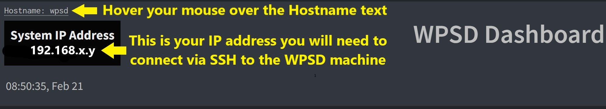
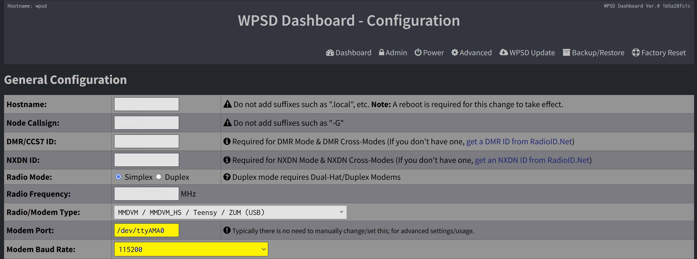

# Updating your MMDVM Firmware

## Richie Jarvis - G1ZNE - 2025-02-20

1. Find your WPSD machine's IP address from the http://wpsd.local/

       

1. Login to your WPSD machine via SSH

    - Download and Install PuTTY from here: https://www.putty.org/
    - 
    
       
1. Update your Raspbian OS

    - It is worth keeping your Raspbian (the OS that WPSD uses) updated regularly.  You can re-run the commandline given periodically to do so.
    
    - It will take a while.  Go make a coffee/tea/beverage of your choice.  It will connect to the internet and download everything needed, then install it.  When it returns to the commandline prompt `pi-star@wpsd:~ $` it is done.
    
      <span style="color:red">
      **Very IMPORTANT: Ignore the message "The following packages have been kept back:"**
      
      **If you attempt to fix it, you may well break your WSPD installation.**     
      </span>
    
    - Copy and run this commandline - the output is long and boring...      
        
        ```
        sudo apt update ; sudo apt upgrade -y ; sudo apt autoremove -y
        ```    

1. Check what MMDVM Hat you are using and that the serial port and baudrate are correct.

  - Copy and run this commandline:

    `sudo wpsd-detectmodem`

  - The output you will see will be similar to this:

    ```
    pi-star@wpsd:~ $ sudo wpsd-detectmodem
    Detected MMDVM_HS Port: /dev/ttyAMA0 (GPIO) Baud: 115200 Protocol: Unknown
    Modem Data: MMDVM_HS_Hat-v1.5.2 20201108 14.7456MHz ADF7021 FW by CA6JAU GitID #89daa2000600056590000094E545047
    ```
  - Here are the important pieces of info you will need to upgrade your MMDVM Hat firmware
    - Detected HAT Type:
    
      `Detected MMDVM_HS`
    
    
    - The Hardware type
    
      `ADF7021`
      
    - My MMDVM currently has v1.5.2 loaded - in this example I am updating to v1.6.2
    
      `MMDVM_HS_Hat-v1.5.2`

1. Make sure your MMDVM settings listed in the output from the `wpsd-detectmodem` command above match the settings in the WPSD Configuration screen here: http://wpsd.local/admin/configure.php
    
    - Output from `wpsd-detectmodem` 
      
      `Port: /dev/ttyAMA0 (GPIO) Baud: 115200`
    
    - Make sure the WPSD Webconfig screen reflects this information in these fields:
    
             
       
1. Run the update command

- Copy and run this commandline:

    `sudo wpsd-detectmodem`

  - The output you will see will be similar to this:

    ```
    pi-star@wpsd:~ $ sudo wpsd-detectmodem
    Detected MMDVM_HS Port: /dev/ttyAMA0 (GPIO) Baud: 115200 Protocol: Unknown
    Modem Data: MMDVM_HS_Hat-v1.5.2 20201108 14.7456MHz ADF7021 FW by CA6JAU GitID #89daa2000600056590000094E545047
    ```
       